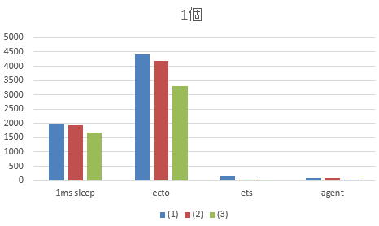
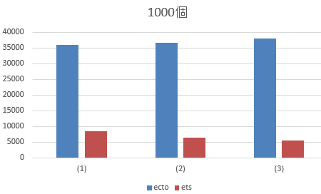

# Agent や ets の latency の確認

ets の lookup の速さを知りたいので、:timer.tc/1 でベンチをしてみる。Agent はおまけ。

## 前準備

- Phoenix のプロジェクトを作成
  - `mix phoenix.new test --no-brunch --database mysql`

- MySQLで下記テーブルを作成
  - テーブル名：phoenix_test001
  - userid: testuser
  - password: passwd

- config/dev.exs に DB の設定、ポートは5000に変更

- 動作確認
  - `mix phoenix.server`

- model とテストの準備

  - `mix phoenix.gen.model Test test code:integer str:string`
  - `vi priv/repo/migrations/20160801045320_create_test.exs`
  - `mix ecto.migrate`
  - `vi priv/repo/seeds.exs`
  - `mix run priv/repo/seeds.exs`

## ベンチ環境
- [さくらのVPSの4GB](http://vps.sakura.ad.jp/specification/)
  - CPU: 4core
  - MEM: 4GB

- Erlang: 18.2.1
- Elixir: 1.3.2
- Phoenix: 1.2.0

## ベンチする内容

※Agent/ETS には、起動時に Ecto からデータを読み込んでセットしている

- / :timer.tc/1 の精度の確認のため、Process.sleep(1)で1ms(1000μs)スリーブしているだけ

- /ecto1: Ectoから1レコードを読み込む
  - /ecto1000: Ectoから1000レコード(code: 1～1000)を読み込む

- /ets1: etsから1つ読み込む
  - /ets1000: etsから1つを1000回読み込む

- /agent1: "1"を状態にセットしたAgentから値を取得

## ベンチ結果

各テストの各回ごとに `mix phoenix.server` を実行しなおしている（= URLごとに3回再起動）

URL | μs(1) | (2) | (3)
--- | --- | --- | ---
1msのsleep | 1985 | 1937 | 1675
/ecto1 | 4409 | 4177 | 3306
/ets1 | 157 | 25 | 33
/agent1 | 99 | 79 | 25

URL | μs(1) | (2) | (3)
--- | --- | --- | ---
/ecto1000 | 36027 | 36620 | 38004
/ets1000 | 8504 | 6376 | 5577

### 1個のグラフ

### 1000個のグラフ

## まとめ
データを1つ取得 x 1000回ループという、Ecto に比べてちょっと不利な条件にもかかわらず、ets の読み書き性能すごい。気に入った。
